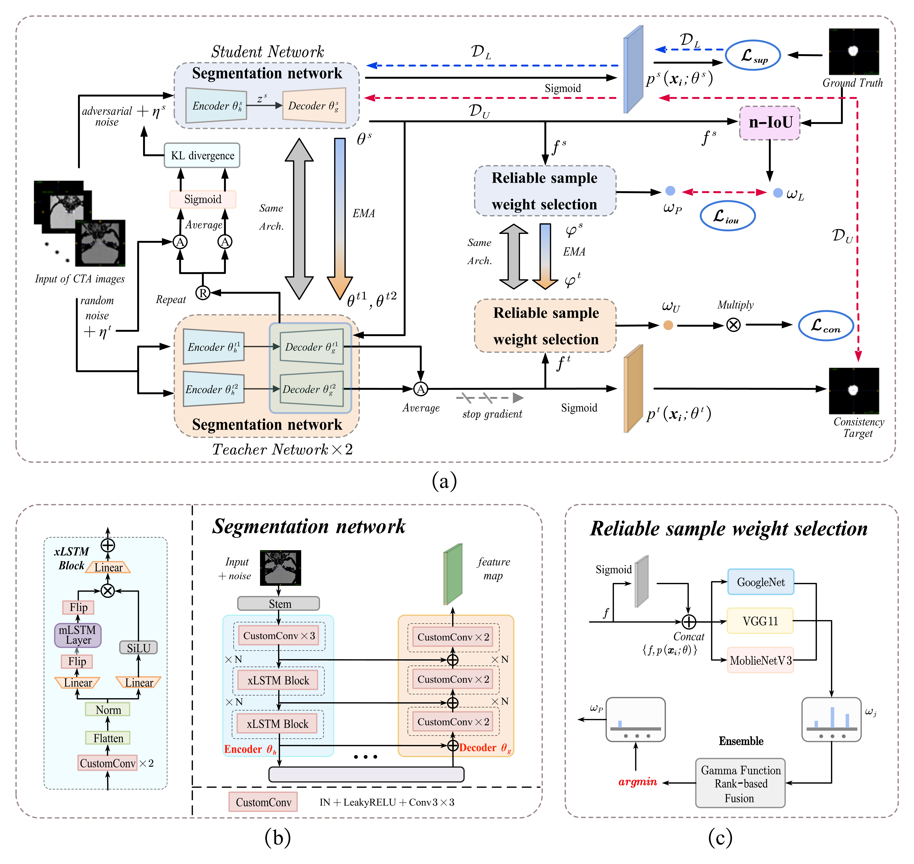
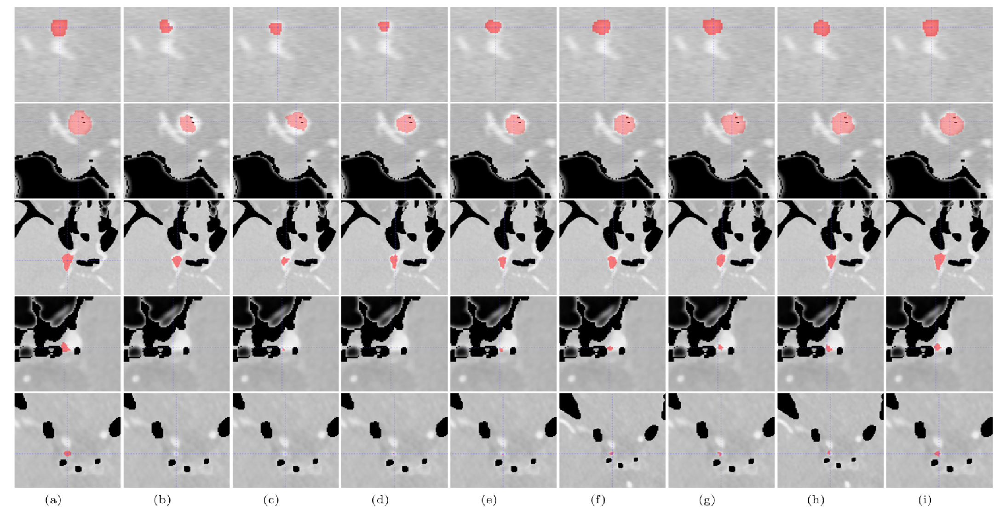

# Semi-supervised intracranial aneurysm segmentation via reliable weight selection
## Introduction

This is the code repository of [Semi-supervised intracranial aneurysm segmentation via reliable weight selection](https://link.springer.com/article/10.1007/s00371-024-03730-7).

### Framework

!

## Usage
### Dataset

Download dataset from Google Drive [Aneurysm](https://drive.google.com/drive/folders/1GMZr4QdJIn4W_txdkpUv1ES4Fehu8802?usp=sharing).
### Build

`env` for `Ubuntu22.04 python3.8`

```
pip install -r requirements.txt
```

`cd /Config/Data_Config.py`   Modify the data path in it.

### Train

```
cd /Main/Baseline_Train
run xLGNet_Train.py
```

## Experiment

### example

!

## Citation
```
@article{cao2024semi,
  title={Semi-supervised intracranial aneurysm segmentation via reliable weight selection},
  author={Cao, Wei and Chen, Xin and Lv, Jianping and Shao, Liang and Si, Weixin},
  journal={The Visual Computer},
  pages={1--13},
  year={2024},
  publisher={Springer}
}
```

